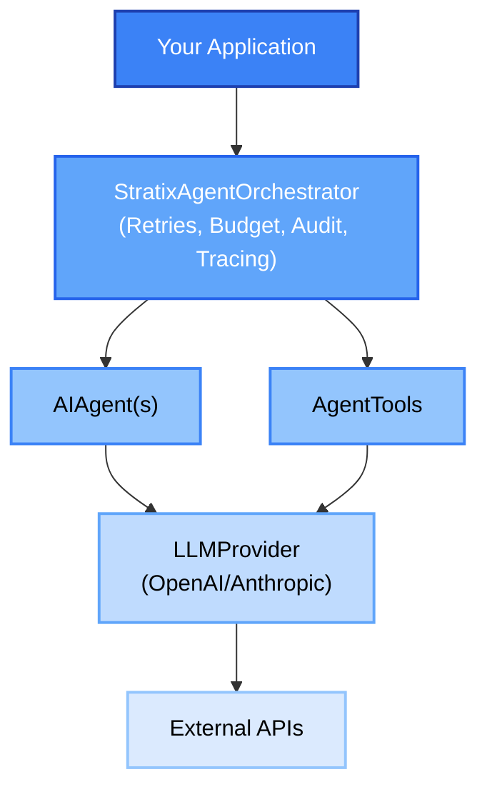

# Stratix AI Agent Framework - API Reference

Complete API documentation for all Stratix packages.

## Core Packages

### [@stratix/primitives](./primitives.md)

Core primitives and building blocks for Stratix AI agents.

**Key Exports:**

- `AIAgent` - Base class for all agents
- `AgentResult` - Result wrapper with success/failure handling
- `AgentContext` - Execution context with session and budget management
- `ExecutionTrace` - Execution tracing for debugging
- `AgentMemory` - Memory interface and implementations
- `Entity`, `ValueObject`, `AggregateRoot` - DDD building blocks
- `Result` pattern - Type-safe error handling
- `Money`, `Email`, `Currency` - Common value objects

[View Full Documentation](./primitives.md)

---

### [@stratix/abstractions](./abstractions.md)

Core abstractions and interfaces for extending Stratix.

**Key Exports:**

- `LLMProvider` - Interface for LLM provider implementations
- `AgentTool` - Base class for creating agent tools
- `AgentOrchestrator` - Interface for orchestrating agents
- `AgentRepository` - Interface for persisting agents
- `ExecutionAuditLog` - Interface for audit logging
- `Container`, `Logger`, `Repository` - Infrastructure abstractions
- `Command`, `Query`, `Event` - CQRS pattern support
- `Plugin` - Plugin system interfaces

[View Full Documentation](./abstractions.md)

---

### [@stratix/impl-ai-agents](./runtime.md)

Runtime implementations for orchestrating and managing agents.

**Key Exports:**

- `StratixAgentOrchestrator` - Main orchestrator with retries, budget enforcement, and audit logging
- `InMemoryAgentRepository` - In-memory agent persistence
- `InMemoryExecutionAuditLog` - In-memory audit logging

**Features:**

- Automatic retries on failure
- Budget enforcement
- Execution timeout handling
- Comprehensive audit logging
- Performance statistics

[View Full Documentation](./runtime.md)

---

### [@stratix/testing](./testing.md)

Testing utilities for deterministic AI agent testing.

**Key Exports:**

- `MockLLMProvider` - Mock LLM provider for testing
- `AgentTester` - Test harness with assertions
- `expectSuccess`, `expectFailure` - Type-safe assertions
- `expectCostWithinBudget`, `expectDurationWithinLimit` - Performance assertions
- `createTestContext`, `createTestAgentId` - Test helpers

**Features:**

- Deterministic responses without API calls
- Type-safe assertions
- Performance testing
- Call history tracking

[View Full Documentation](./testing.md)

---

## Extension Packages

### [@stratix/ext-ai-agents-openai](./extensions.md#stratixext-ai-agents-openai)

OpenAI provider implementation.

**Supported Models:**

- GPT-4, GPT-4 Turbo
- GPT-3.5 Turbo
- Text Embedding 3 (Small/Large)

**Features:**

- Function calling
- Streaming
- Structured output (JSON schema)
- Automatic cost calculation

[View Full Documentation](./extensions.md#stratixext-ai-agents-openai)

---

### [@stratix/ext-ai-agents-anthropic](./extensions.md#stratixext-ai-agents-anthropic)

Anthropic provider implementation.

**Supported Models:**

- Claude 3 Opus
- Claude 3 Sonnet
- Claude 3.5 Sonnet
- Claude 3 Haiku

**Features:**

- Tool use
- Streaming
- System prompts
- Automatic cost calculation

[View Full Documentation](./extensions.md#stratixext-ai-agents-anthropic)

---

## Quick Start

### Installation

```bash
# Core packages
pnpm add @stratix/primitives @stratix/abstractions

# Runtime
pnpm add @stratix/impl-ai-agents

# LLM providers
pnpm add @stratix/ext-ai-agents-openai
# or
pnpm add @stratix/ext-ai-agents-anthropic

# Testing (dev dependency)
pnpm add -D @stratix/testing
```

### Basic Example

```typescript
import { AIAgent, AgentResult, AgentContext } from '@stratix/primitives';
import { OpenAIProvider } from '@stratix/ext-ai-agents-openai';
import {
  StratixAgentOrchestrator,
  InMemoryAgentRepository,
  InMemoryExecutionAuditLog,
} from '@stratix/impl-ai-agents';

// Create an agent
class SummaryAgent extends AIAgent<{ text: string }, { summary: string }> {
  constructor(private provider: OpenAIProvider) {
    super();
  }

  async execute(input: { text: string }): Promise<AgentResult<{ summary: string }>> {
    const response = await this.provider.chat({
      model: 'gpt-4',
      messages: [
        { role: 'system', content: 'You are a summarization assistant.' },
        { role: 'user', content: `Summarize: ${input.text}` },
      ],
    });

    return AgentResult.success({ summary: response.content }, { model: 'gpt-4', duration: 0 });
  }
}

// Setup orchestrator
const provider = new OpenAIProvider({
  apiKey: process.env.OPENAI_API_KEY!,
});

const repository = new InMemoryAgentRepository();
const auditLog = new InMemoryExecutionAuditLog();

const orchestrator = new StratixAgentOrchestrator(repository, auditLog, provider, {
  auditEnabled: true,
  budgetEnforcement: true,
});

// Register and execute
const agent = new SummaryAgent(provider);
await orchestrator.registerAgent(agent);

const context = new AgentContext({
  userId: 'user-123',
  sessionId: 'session-456',
  environment: 'production',
});
context.setBudget(1.0);

const result = await orchestrator.executeAgent(
  agent.id,
  { text: 'Long text to summarize...' },
  context
);

if (result.isSuccess()) {
  console.log('Summary:', result.data.summary);
  console.log('Cost:', result.metadata.cost);
}
```

---

## Package Overview

```
@stratix/
├── primitives           # Core building blocks
├── abstractions         # Interfaces and abstractions
├── impl-ai-agents       # Runtime orchestration
├── ext-ai-agents-openai # OpenAI provider
├── ext-ai-agents-anthropic # Anthropic provider
└── testing              # Testing utilities
```

## Architecture



## Key Concepts

### Agents

Agents are the core abstraction. They encapsulate a specific capability and can be composed together.

```typescript
class MyAgent extends AIAgent<Input, Output> {
  async execute(input: Input): Promise<AgentResult<Output>> {
    // Implementation
  }
}
```

### Result Pattern

All agent executions return `AgentResult<T>` which encapsulates success or failure.

```typescript
const result = await agent.execute(input);

if (result.isSuccess()) {
  console.log(result.data);
} else {
  console.error(result.error);
}
```

### Tools

Tools extend agent capabilities with reusable, validated functions.

```typescript
class MyTool extends AgentTool<Input, Output> {
  readonly name = 'my_tool';
  readonly description = 'My tool description';

  async validate(input: unknown): Promise<Input> {
    // Implement validation
    if (typeof input !== 'object' || !input) {
      throw new Error('Invalid input');
    }
    return input as Input;
  }

  async execute(input: Input): Promise<Output> {
    // Implementation
  }

  getDefinition() {
    return {
      name: this.name,
      description: this.description,
      parameters: { /* parameter schema */ }
    };
  }
}
```

### Context

Context carries execution metadata, session info, and budget through the execution chain.

```typescript
const context = new AgentContext({
  userId: 'user-123',
  sessionId: 'session-456',
  environment: 'production',
});

context.setBudget(1.0); // Max $1.00
context.addMessage({ role: 'user', content: 'Hello' });
```

### Orchestration

The orchestrator manages agent lifecycle, retries, budgets, and audit logging.

```typescript
const orchestrator = new StratixAgentOrchestrator(repository, auditLog, provider, {
  autoRetry: true,
  budgetEnforcement: true,
  auditEnabled: true,
});
```

---

## Common Patterns

### Creating a Simple Agent

```typescript
class SimpleAgent extends AIAgent<string, string> {
  constructor(private provider: LLMProvider) {
    super();
  }

  async execute(input: string): Promise<AgentResult<string>> {
    const response = await this.provider.chat({
      model: 'gpt-4',
      messages: [{ role: 'user', content: input }],
    });

    return AgentResult.success(response.content, {
      model: 'gpt-4',
      duration: 0,
    });
  }
}
```

### Agent with Tools

```typescript
class AgentWithTools extends AIAgent<Input, Output> {
  constructor(
    private provider: LLMProvider,
    private tools: AgentTool<any, any>[]
  ) {
    super();
  }

  async execute(input: Input): Promise<AgentResult<Output>> {
    const response = await this.provider.chat({
      model: 'gpt-4',
      messages: [...],
      tools: this.tools.map(t => t.getDefinition())
    });

    if (response.toolCalls) {
      // Execute tools and continue
    }

    return AgentResult.success(output, metadata);
  }
}
```

### Multi-Agent Workflow

```typescript
// Agent 1: Analyze
const analysis = await orchestrator.executeAgent(analyzerAgent.id, input, context);

if (analysis.isSuccess()) {
  // Agent 2: Process
  const processed = await orchestrator.executeAgent(processorAgent.id, analysis.data, context);

  if (processed.isSuccess()) {
    // Agent 3: Summarize
    const summary = await orchestrator.executeAgent(summarizerAgent.id, processed.data, context);
  }
}
```

---

## Testing

### Unit Testing

```typescript
import { AgentTester, MockLLMProvider } from '@stratix/testing';

describe('MyAgent', () => {
  let tester: AgentTester;

  beforeEach(() => {
    tester = new AgentTester();
  });

  it('should process input correctly', async () => {
    tester.setMockResponse({
      content: '{"result": "success"}',
      usage: { promptTokens: 10, completionTokens: 20, totalTokens: 30 },
    });

    const result = await tester.test(agent, input);

    expect(result.passed).toBe(true);
    tester.assertCallCount(1);
  });
});
```

### Integration Testing

```typescript
// Use real providers with test API keys
const provider = new OpenAIProvider({
  apiKey: process.env.TEST_OPENAI_API_KEY!,
});

const result = await agent.execute(testInput);

expect(result.isSuccess()).toBe(true);
expectCostWithinBudget(result, 0.1);
expectDurationWithinLimit(result, 5000);
```

---

## Additional Resources

- [Getting Started Guide](../guides/getting-started.md)
- [Examples](../../examples/)
- [Migration from LangChain](../guides/migration-from-langchain.md)
- [Troubleshooting](../guides/troubleshooting.md)
- [GitHub Repository](https://github.com/pcarvajal/stratix)

---

## Support

- GitHub Issues: https://github.com/pcarvajal/stratix/issues
- Discord Community: https://discord.gg/stratix
- Email: support@stratix.dev
