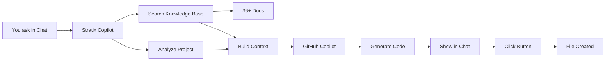

# Stratix Copilot

**AI-powered coding assistant for Stratix framework with intelligent code generation and context-aware suggestions.**

Stratix Copilot is a VS Code extension that enhances GitHub Copilot with deep knowledge of the Stratix framework, enabling you to generate DDD/CQRS code that follows best practices automatically.

## What is Stratix Copilot?

Stratix Copilot is an intelligent VS Code extension that integrates with GitHub Copilot Chat to provide:

- 🤖 **Context-Aware AI** - Understands your project structure (DDD/Modular)
- 📚 **Framework Knowledge** - Trained on complete Stratix documentation
- 🎯 **Smart Code Generation** - Generates entities, commands, queries, value objects
- 🔄 **Auto-Updates** - Knowledge base stays synchronized with framework updates
- 📁 **One-Click File Creation** - Generate and save files directly from chat

## Key Features

### RAG-Enhanced Responses

Stratix Copilot uses **Retrieval Augmented Generation (RAG)** to provide accurate, framework-specific responses:

- Searches 36+ documentation sources
- Retrieves relevant patterns and examples
- Generates code following exact Stratix conventions
- Shows source references for transparency

### Slash Commands

Quick access to common code generation tasks:

| Command | Description |
|---------|-------------|
| `/entity` | Generate a domain entity with props and methods |
| `/command` | Generate a CQRS command with handler |
| `/query` | Generate a CQRS query with handler |
| `/vo` | Generate a value object with validation |
| `/repository` | Generate repository interface |
| `/context` | Generate complete bounded context |
| `/refactor` | Get refactoring suggestions for DDD patterns |
| `/explain` | Explain Stratix concepts with examples |

### Intelligent File Creation

After generating code, Stratix Copilot shows action buttons to create files automatically:

- **Create Entity File** - Saves to correct location in your project
- **Create Command File** - Follows your project structure
- **Create Query File** - Proper CQRS organization
- And more...

### Automatic Knowledge Updates

The knowledge base is automatically updated when Stratix documentation changes:

- **Version Tracking** - KB version matches framework version
- **CI/CD Integration** - Auto-updates via GitHub Actions
- **Manual Updates** - `Stratix: Rebuild Knowledge Base` command

## How It Works



1. **You ask** in GitHub Copilot Chat with `@stratix`
2. **Analyzes** your project structure and existing code
3. **Searches** knowledge base for relevant documentation
4. **Enriches** the prompt with Stratix patterns and examples
5. **Generates** code using GitHub Copilot's LLM
6. **Shows** action buttons to create files
7. **Creates** files in the correct location when you click

## Example Usage

### Generate an Entity

```
@stratix /entity Product with name, price, and category
```

**Result:**
- Generates complete `Product` entity following Stratix patterns
- Shows "Create Entity File" button
- Click to save to `src/domain/entities/Product.ts`

### Generate a Command

```
@stratix /command CreateProduct with productId, name, price
```

**Result:**
- Generates command DTO and handler
- Follows CQRS patterns
- Includes proper imports and types
- One-click file creation

### Ask Questions

```
@stratix how do I implement a repository with PostgreSQL?
```

**Result:**
- Retrieves relevant documentation
- Shows code examples
- Explains step-by-step
- Includes source references

## Requirements

- **VS Code** 1.85.0 or higher
- **GitHub Copilot** subscription
- **Node.js** 18.0.0 or higher (for development)

## Next Steps

- [Installation](./installation.md) - Install Stratix Copilot
- [Usage Guide](./usage.md) - Learn how to use all features
- [Commands Reference](./commands.md) - Complete command list

## Version Information

Current Knowledge Base:
- **Version**: Matches Stratix framework version
- **Documents**: 36+ indexed sources
- **Auto-Updates**: Weekly + on documentation changes

Check your KB version: `Cmd+Shift+P` → `Stratix: Show Knowledge Base Info`
